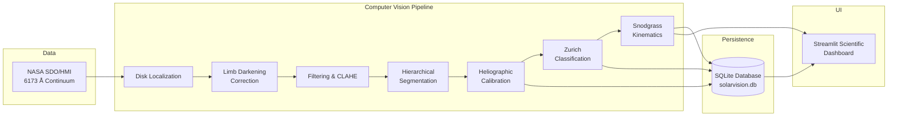

# SolarVision: System Architecture & Design Specification

## 1. Executive Summary
**SolarVision** is an end-to-end Computer Vision system engineered for automated solar active region segmentation, heliographic calibration, Zurich-McIntosh morphological classification, and multi-day kinematic tracking. The system operates on space-borne continuum imagery acquired by the Helioseismic and Magnetic Imager (HMI) aboard the NASA Solar Dynamics Observatory (SDO).

SolarVision implements an autonomous physical processing pipeline that neutralizes the atmospheric/optical solar limb-darkening phenomenon, isolates umbral cores and penumbral filaments through dual-level adaptive photometric thresholding, projects pixel coordinates into Stonyhurst heliographic latitude and longitude $(B, L)$, and tracks active regions across solar rotations using empirical differential rotation kinematics.

---

## 2. Core System Components

### 2.1 Ingestion and Data Validation Layer (`src/solar_data.py`)
- **Network Interface**: Communicates via HTTPS with the NASA SDO/HMI near-realtime image distribution server. Handles connection timeouts, SSL negotiation, and HTTP retry semantics.
- **Validation Engine**: Enforces strict verification of image dimensions (minimum $512 \times 512$, typically $1024 \times 1024$), color channels (RGB or single-channel grayscale), and dynamic range (8-bit $[0, 255]$ or 16-bit normalized).
- **Idempotency & Deduplication**: Computes the SHA-256 hash of every incoming image payload. Duplicate files are served instantly from cache without redundant disk or network operations.

### 2.2 Solar Disk Detection & Calibration (`src/disk_detector.py`)
- **Centroid & Limb Extraction**: Executes adaptive Otsu thresholding combined with Canny edge detection ($T_{\text{lower}} = 50, T_{\text{upper}} = 150$) on downsampled continuum frames.
- **Circle Fitting**: Extracts the largest external contour representing the solar photosphere limb and computes the minimum enclosing circle to determine the sub-pixel center $(x_c, y_c)$ and disk radius $R$.
- **Effective Disk Masking**: Imposes an empirical margin ($0.985 \cdot R$) to prevent high-noise limb boundary artifacts from contaminating downstream active region segmentation.

### 2.3 Physical Limb-Darkening Compensation (`src/limb_darkening.py`)
- **Physical Model**: Implements the quadratic limb-darkening profile for the solar continuum at $6173\text{ \AA}$:
  $$\mu(x, y) = \cos\theta = \sqrt{1 - \left(\frac{r}{R}\right)^2} \quad \text{where } r = \sqrt{(x - x_c)^2 + (y - y_c)^2}$$
  $$\phi(\mu) = 1 - u(1 - \mu) - v(1 - \mu)^2$$
  with empirical coefficients $u = 0.56$ and $v = 0.20$.
- **Photometric Normalization**: Flattens intensity across the disk:
  $$I_{\text{flattened}}(x, y) = \frac{I_{\text{raw}}(x, y)}{\phi(\mu)}$$
  This normalizes quiet-Sun background pixels from center to limb to a uniform intensity $I_{\text{quiet}} \approx 200 \text{ DN}$, enabling consistent global and adaptive thresholding.

### 2.4 Hierarchical Segmentation & Detection (`src/segmentation.py` & `src/detector.py`)
- **Dual-Level Photometric Thresholding**:
  - **Umbral Core**: $I_{\text{flat}}(x, y) \le 0.55 \cdot I_{\text{quiet}}$
  - **Penumbral Filament**: $0.55 \cdot I_{\text{quiet}} < I_{\text{flat}}(x, y) \le 0.88 \cdot I_{\text{quiet}}$
- **Morphological Refinement**: Applies opening ($3 \times 3$ elliptical structuring element) to eliminate isolated single-pixel shot noise, followed by closing to bridge fragmented penumbral borders.
- **Hierarchical Contour Parsing**: Identifies active regions with area gating ($20 \le A_{\text{pixels}} \le 50,000$), recording bounding boxes $[x, y, w, h]$, sub-pixel centroids, and region patches.

### 2.5 Calibrated Heliographic Feature Extraction (`src/feature_extractor.py`)
- **Orthographic Inverse Projection**: Maps pixel centroids $(c_x, c_y)$ to Stonyhurst Heliographic coordinates:
  $$\rho = \arcsin\left(\frac{r}{R}\right)$$
  $$B = \arcsin\left(\cos\rho \sin B_0 + \frac{c_y - y_c}{r} \sin\rho \cos B_0\right)$$
  $$L = \arcsin\left(\frac{(c_x - x_c)\sin\rho}{r \cos B}\right)$$
  where $B$ is heliographic latitude, $L$ is Central Meridian Distance (CMD) longitude, and $B_0$ is solar sub-Earth tilt.
- **Foreshortening Area Correction**: Converts projected pixels to physical Micro-Hemispheres of the Sun (MSH):
  $$\text{Area}_{\text{MSH}} = \frac{A_{\text{pixels}}}{2\pi R^2 \cos\rho} \times 10^6$$
- **Morphological Metrics**: Calculates isoperimetric circularity $C = \frac{4\pi A}{P^2}$, equivalent diameter, umbra-to-penumbra area ratio, and intensity contrast.

### 2.6 Zurich-McIntosh Classification & Risk Engine (`src/classifier.py`)
- **Deterministic Morphological Rules**:
  - **Class A**: Small unipolar pore without penumbra ($A < 100\text{ MSH}$, no penumbra).
  - **Class B**: Bipolar sunspot pair without penumbra.
  - **Class C**: Bipolar group with penumbra on only one spot.
  - **Class D**: Bipolar group with penumbra on both ends; longitudinal extent $< 10^\circ$.
  - **Class E**: Extensive bipolar group; longitudinal extent $10^\circ - 15^\circ$.
  - **Class F**: Very large/extended bipolar group; longitudinal extent $> 15^\circ$ or $A > 500\text{ MSH}$.
  - **Class H**: Large unipolar spot with mature, symmetric penumbra.
- **Demonstration Risk Score**: Provides a normalized educational metric ($0 - 100$) evaluating visible structural complexity, area, penumbra maturity, and intensity contrast. Explicitly documented as an educational indicator, **not** an operational space weather flare prediction.

### 2.7 Kinematic Differential Rotation Tracker (`src/tracker.py`)
- **Solar Differential Rotation**: Models solar plasma rotation using the Snodgrass (1984) empirical equation:
  $$\omega(B) = 14.71 - 2.39\sin^2 B - 1.78\sin^4 B \quad [^\circ/\text{day}]$$
- **Forward Kinematic Propagation**: For an elapsed time $\Delta t = t_2 - t_1$, the predicted longitude of an active region is:
  $$L_{\text{pred}} = L_1 + \omega(B_1) \cdot \Delta t$$
- **Bipartite Association**: Matches candidates in subsequent frames using a gating cost matrix:
  - Latitude gate: $|B_2 - B_1| \le 5.0^\circ$
  - Longitude residual gate: $|L_2 - L_{\text{pred}}| \le 8.0^\circ$
  - Area ratio gate: $0.25 \le \frac{A_2}{A_1} \le 4.0$
- **Lifecycle Management**: Classifies track status as *Emerging*, *Stable*, *Decaying*, or *Rotated Off-Disk*.

---

## 3. Database Architecture (`src/database.py`)
SolarVision stores state in an ACID-compliant SQLite relational database (`data/solarvision.db`):
- `image_metadata`: Tracks raw image files, SHA-256 checksums, timestamps, and pixel dimensions.
- `observations`: Records observation sessions, detected solar disk parameters $(x_c, y_c, R)$, and quiet-Sun baseline.
- `active_regions`: Stores detailed calibrated features, bounding boxes, Zurich classes, and risk scores.
- `tracks`: Maintains persistent track identifiers, birth/death timestamps, and cumulative drift metrics.
- `trajectory_points`: Links individual observation detections to tracks with kinematic residuals.

---

## 4. Evaluation and Benchmarking Engine (`src/evaluation.py`)
- **Ground Truth Grounding**: Benchmarks detection performance against official NOAA Space Weather Prediction Center (SWPC) Solar Region Summaries (SRS).
- **Metrics Computed**:
  - Intersection-over-Union (IoU) on bounding boxes.
  - Precision, Recall, and $F_1$ Score at IoU thresholds $\tau \in [0.1, 0.5]$.
  - Heliographic Coordinate Mean Absolute Error (MAE) in latitude and longitude.
- **Zero-Fabrication Guarantee**: All validation runs strictly against authenticated SDO observations (including the historic May 10–12, 2024 Mother's Day storm sequence AR3664). Spotless solar minimum discs verify zero false positives.
