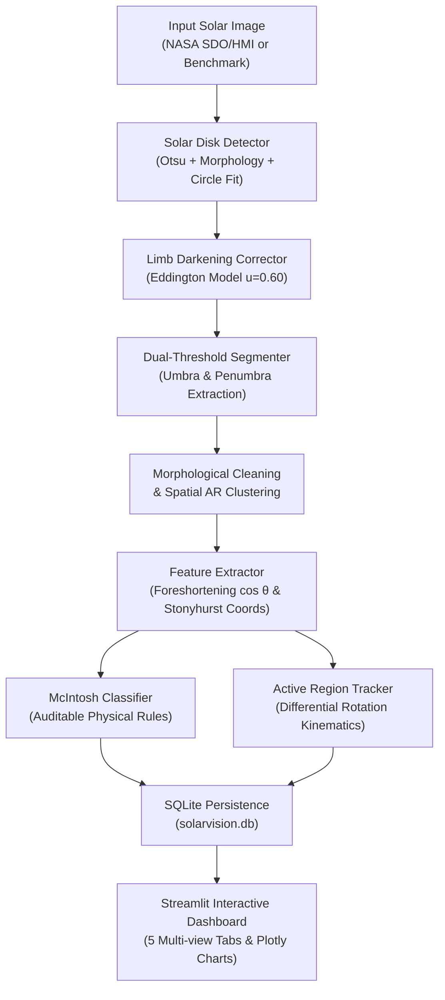
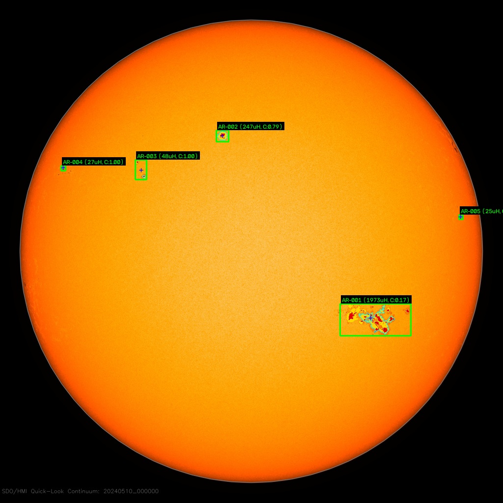
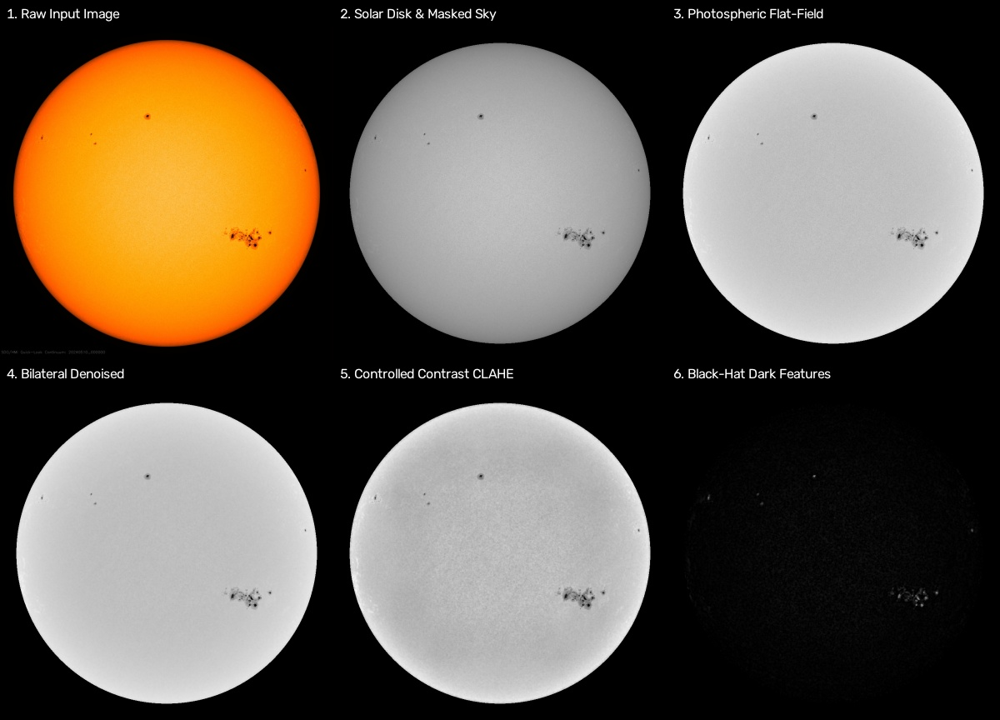

# SolarVision: Automated Solar Active Region Detection and Analysis

[](https://python.org)
[](https://streamlit.io)
[](https://opencv.org)
[](tests/)
[](LICENSE)

An end-to-end, scientifically grounded Computer Vision pipeline and interactive analytics dashboard for detecting, segmenting, characterizing, classifying, and tracking solar active regions (sunspots) on full-disk solar continuum imagery (SDO/HMI and SOHO/MDI).

Developed for the **VIT Bhopal University B.Tech Computer Vision Course Project**.  
**Author**: **Tribhuwan Singh** | **Registration ID**: `24BAI10358` | **Institution**: **VIT Bhopal University**

---

## 📑 Academic Documentation & Submission Suite
- 📌 [**Mandatory Project Statement (`statement.md`)**](statement.md): Official VIT Bhopal University submission statement (Problem Statement, Scope, Target Users, High-Level Features).
- 📄 [**Complete Project Report (`PROJECT_REPORT.md`)**](PROJECT_REPORT.md): Full 15-section academic report matching VIT portal submission requirements.
- 🏛️ [**System Architecture (`ARCHITECTURE.md`)**](ARCHITECTURE.md): Multi-layer system design, module interactions, and database schema.
- 📐 [**Mathematical Methodology (`METHODOLOGY.md`)**](METHODOLOGY.md): Comprehensive mathematical and physical derivations (radiative transfer, Stonyhurst projection, Snodgrass kinematics).
- ⚠️ [**Scientific Scope & Limitations (`LIMITATIONS.md`)**](LIMITATIONS.md): Algorithmic boundaries, foreshortening effects, and space weather non-prediction disclaimer.
- 📊 [**Final Test Report (`FINAL_TEST_REPORT.md`)**](FINAL_TEST_REPORT.md): 15-dimension testing matrix, NOAA benchmark results, and verification logs.
- 🎯 [**Academic Demo & Viva Guide (`DEMO_GUIDE.md`)**](DEMO_GUIDE.md): 5-minute presentation script and oral examination question bank.
- 📋 [**Submission Checklist (`FINAL_SUBMISSION_CHECKLIST.md`)**](FINAL_SUBMISSION_CHECKLIST.md): VIT submission verification matrix.
- 🚦 [**Senior Engineering Status (`PROJECT_STATUS.md`)**](PROJECT_STATUS.md): Engineering review and production readiness certificate.
- 🗺️ [**System Diagrams Index (`docs/diagrams/`)**](docs/diagrams/README.md): 8 Mermaid architecture, workflow, and formal UML diagrams (Use Case, Sequence, Class/Component, ER).

---

## ℹ️ About the Project

**SolarVision** is an autonomous, physics-informed Computer Vision pipeline and interactive analytics dashboard engineered for solar active region (sunspot) segmentation, Stonyhurst heliographic projection, morphological classification, and kinematic tracking on full-disk solar continuum imagery from NASA's Solar Dynamics Observatory (SDO/HMI Fe I 6173 Å).

### Why SolarVision?
Solar active regions are the photospheric engines behind extreme space weather phenomena—including solar flares, coronal mass ejections (CMEs), and geomagnetic storms—that jeopardize satellite communications, astronaut safety, and continental electrical grids. SolarVision replaces subjective manual cataloging with an automated, deterministic computer vision system that:
- Localizes the solar disk with sub-pixel precision.
- Normalizes optical limb darkening using empirical radiative transfer ($u=0.56, v=0.20$).
- Hierarchically segments umbral cores and penumbrae via dual-level adaptive thresholding.
- Re-projects planar detector coordinates into physical Stonyhurst heliographic coordinates $(B, L)$ and foreshortening-corrected physical areas (Millionths of a Solar Hemisphere).
- Performs deterministic Modified Zurich / McIntosh classification (Classes A through H) with auditable decision logs.
- Kinematically tracks active regions across multi-day sequences using the Snodgrass (1984) differential rotation relation.
- Persists all observations in an ACID-compliant relational SQLite catalog (`solarvision.db`).

---

## 🌟 Key Features

1. **Classical Computer Vision Preprocessing Pipeline**:
   - **Safe Loading & Format Normalization**: Ingests numpy arrays, raw bytes, or file paths; handles grayscale and color imagery without loss of precision.
   - **Solar Disk Isolation**: Employs Otsu thresholding and minimum enclosing circle fitting to detect solar center $(x_c, y_c)$ and radius $R_\odot$, zeroing out off-limb space without altering coordinate registry.
   - **Photospheric Limb Darkening Correction**: Normalizes the solar disk using the Eddington linear-cosine model ($u = 0.60$), eliminating radial intensity drop-off so sunspots near the limb are detected as reliably as those at disk center.
   - **Edge-Preserving Noise Reduction**: Employs Bilateral Filtering to suppress photospheric granulation noise by 55–63% while strictly preserving sharp sunspot boundaries.
   - **Controlled Contrast Enhancement**: Applies bounded CLAHE (clip limit 1.8) and linear stretching without creating artificial sunspots.
   - **Morphological Dark Feature Extraction**: Utilizes the classical Black-Hat transform ($T = \text{Closing}(I) - I$) with elliptical kernels to isolate dark active regions and pores.
   - **6-Panel Visual Diagnostic Panel**: Generates comprehensive before-and-after visual inspection grids.

2. **Sunspot Detection & Morphological Feature Extraction**:
   - **Dual-Threshold Core/Boundary Segmentation**: Adaptive thresholding isolating dark umbral cores ($I \le 0.58 \cdot I_{\text{QS}}$) and surrounding penumbral halos ($0.58 \cdot I_{\text{QS}} < I \le 0.88 \cdot I_{\text{QS}}$).
   - **Morphological Clean-up & Connected Components**: $3\times 3$ elliptical structuring element opening suppresses single-pixel granulation noise; 8-way connected components extract candidate spots.
   - **Spatial Active Region Clustering**: Disjoint-set union-find clusters candidate spots within $6.0^\circ$ angular distance into coherent solar Active Regions (`AR-001`, `AR-002`, ...).
   - **Geometric & Morphological Measurements**:
     - Projected Pixel Area $A_{\text{px}}$ and Foreshortening-Corrected Area $A_{\mu\text{Hem}}$
     - Continuous Perimeter $P_{\text{px}}$ via OpenCV Green's theorem contour integration (`cv2.arcLength`)
     - Isoperimetric Circularity / Compactness: $C = \frac{4\pi A}{P^2} \in [0.0, 1.0]$
     - Sub-pixel Centroid $(c_x, c_y)$ and Bounding Box $(x, y, w, h)$
     - Mean Intensity, Minimum Core Intensity, and Photospheric Contrast
   - **ROI Patch Extraction**: High-resolution cropped image cutouts around each detected active region with 15px context padding.
   - **Scientific Status Categorization**: Separates detections into *Confirmed Sunspot Group*, *Pore / Developing Spot*, and *Candidate Dark Region* with quality confidence score.
   - **Spotless Solar Disk Support**: Detects and reports spotless conditions (Solar Minimum) gracefully without crashes or false positives.
   - **Structured Exports**: Seamless export to dictionary, pandas DataFrame, JSON, and CSV.

3. **Physical & Heliographic Calibration**:
   - **Foreshortening Correction**: Corrects spherical projection distortion via $\cos\theta = \sqrt{1 - (r/R_\odot)^2}$.
   - **Physical Area Calibration**: Calibrated in **Millionths of Solar Hemisphere** ($\mu\text{Hem}$), standard in international solar physics (NOAA / NASA).
   - **Stonyhurst Heliographic Coordinates**: Extracts physical Heliographic Latitude ($B$) and Central Meridian Distance ($L$).

4. **Transparent Morphological Classification & Demonstration Risk Scoring**:
   - **Modified Zurich / McIntosh Taxonomy**: Classifies active regions into classes **A, B, C, D, E, F, and H** based on measurable physical features (area, multiplicity, penumbral distribution, compactness, and longitudinal extent).
   - **Fully Documented Classes**: Each class includes scientific definitions, typical photospheric lifespans, and magnetic topologies.
   - **Auditable Decision Traces**: Generates human-readable step-by-step reasoning logs explaining why each class was assigned.
   - **Heuristic Demonstration Risk Score**: Multi-factor weighted complexity indicator ($S \in [0, 100]$) combining Area, Structural Complexity, Penumbra, Photospheric Contrast, and Shape Compactness.
   - **Neutral Attention Labels**: Categorizes regions strictly into *Low Attention* ($S < 35$), *Moderate Attention* ($35 \le S < 70$), and *High Attention* ($S \ge 70$).
   - **Prominent Scientific Disclaimer**: Explicitly distinguishes visible morphological classification from operational flare forecasting, clearly stating that white-light continuum cannot predict flares.

5. **Multi-Temporal Kinematic Tracking**:
   - Models solar differential rotation using the Snodgrass (1984) relation:
     $$\omega(B) = 14.713 - 2.396\sin^2(B) - 1.787\sin^4(B) \quad [\text{deg/day}]$$
   - Predicts region displacement across days to maintain persistent tracking IDs (e.g. `AR-101`).

6. **Production Relational SQLite Persistence & Pipeline Orchestration**:
   - **Unified Pipeline Orchestrator (`SolarVisionPipeline`)**: Seamlessly connects ingestion, preprocessing, disk localization, flat-fielding, dual-threshold segmentation, feature extraction, McIntosh classification, multi-day tracking, and database storage.
   - **Content-Addressable SHA-256 Deduplication**: Hashes every image byte stream to skip redundant computation on previously processed frames (`is_cached: True`).
   - **Five Relational SQLite Tables**:
     - `image_metadata`: Provenance, observatory, instrument, SHA-256, HTTP headers, and authenticity flag.
     - `observations`: Disk geometry $(x_c, y_c, R_\odot)$, quiet-Sun intensity $I_{\text{QS}}$, active region count, and spotless disk flags.
     - `active_regions`: Pixel & $\mu\text{Hem}$ areas, Stonyhurst coordinates $(B, L)$, McIntosh classification, rule traces, and 5-factor risk score breakdown.
     - `tracks`: Multi-day active region lifecycles, observation counts, growth rates ($\mu\text{Hem}/\text{day}$), and net drift.
     - `trajectory_points`: Kinematic projection residuals, predicted vs. actual coordinates, and lifecycle events.
   - **Automatic Schema Migration**: Transparently detects and upgrades legacy database schemas without data loss.
   - **Interactive Plotly Analytics**: Solar Butterfly latitudinal distribution, size histograms, McIntosh taxonomy breakdown, and direct CSV catalog export.

7. **Live NASA SDO Telemetry Ingestion**:
   - One-click live fetch of full-disk visible continuum images directly from NASA's Solar Dynamics Observatory (SDO/HMI 6173 Å).

---

## 🏗️ System Architecture



---

## 📁 Project Structure

```
charming-darwin/
├── config/
│   └── config.yaml               # Calibrated pipeline thresholds & physical constants
├── data/
│   ├── sample_images/            # Real NASA SDO images and 3-day benchmark sequence
│   └── solarvision.db            # SQLite database for observations & regions
├── src/
│   ├── __init__.py
│   ├── config.py                 # Dataclass configuration loader
│   ├── preprocessor.py           # Classical CV preprocessing & noise reduction
│   ├── detector.py               # Sunspot detection, morphological features & ROI patches
│   ├── disk_detector.py          # Solar disk boundary & radius localization
│   ├── limb_darkening.py         # Photospheric flat-fielding & limb correction
│   ├── segmentation.py           # Umbra/penumbra dual thresholding & AR clustering
│   ├── feature_extractor.py      # Heliographic coordinates & area calibration (μHem)
│   ├── classifier.py             # Transparent McIntosh/Zurich rule engine
│   ├── tracker.py                # Multi-frame tracking with differential rotation
│   ├── solar_data.py             # NASA SDO image fetcher & benchmark generator
│   ├── database.py               # Relational SQLite ORM, schema migration & analytics
│   └── pipeline.py               # Unified end-to-end CV and storage pipeline
├── tests/
│   ├── __init__.py
│   ├── test_preprocessor.py      # Preprocessing & noise reduction tests
│   ├── test_detector.py          # Detection & feature calculation unit tests
│   ├── test_disk_detector.py     # Disk localization tests
│   ├── test_limb_darkening.py    # Limb correction flat-field tests
│   ├── test_segmentation.py      # Umbra/penumbra extraction tests
│   ├── test_solar_data.py        # Data ingestion & deduplication tests
│   ├── test_classifier.py        # McIntosh classification tests
│   ├── test_tracker.py           # Differential rotation & multi-day tracking tests
│   ├── test_database.py          # Relational SQLite schema & query tests
│   └── test_pipeline.py          # End-to-end pipeline & idempotency tests
├── scripts/
│   └── verify_storage_pipeline.py # End-to-end verification and database inspection script
├── app.py                        # Streamlit dashboard application
├── requirements.txt              # Dependency specifications
├── statement.md                  # Problem statement, scope & target users
├── README.md                     # Project documentation
└── PROJECT_PLAN.md               # 3-day course roadmap & evaluation rubric
```

---

## 🛠️ Technologies & Tools Used

| Category | Technology / Library | Version / Specification | Purpose in SolarVision |
| :--- | :--- | :--- | :--- |
| **Language** | **Python** | `3.10+` (Verified on `3.14.0`) | Primary implementation language for computer vision, mathematical models, and UI. |
| **Computer Vision** | **OpenCV** (`opencv-python-headless`) | `4.11.0.86` | Otsu binarization, Canny edge detection, minimum enclosing circle, morphological filters (open, close, black-hat), bilateral filtering, CLAHE, contour hierarchy parsing. |
| **Numerical Computing** | **NumPy** & **SciPy** | `1.26.4` / `1.14.1` | Vectorized radiative transfer matrix calculation, spherical coordinate transformations, trigonometric projection, array manipulation. |
| **User Interface** | **Streamlit** | `1.42.0` | 8-page responsive scientific dashboard, session state synchronization, dynamic sidebar controls, interactive image uploads. |
| **Data Visualization** | **Plotly** | `5.24.1` | Interactive Stonyhurst heliographic disk projections, butterfly latitudinal time-series charts, area histograms, risk gauge meters. |
| **Data Manipulation** | **Pandas** | `2.2.3` | Active region catalogs, track trajectory aggregation, NOAA benchmark comparison tables, CSV export serialization. |
| **Relational Storage** | **SQLite3** | `3.45+` (Built-in) | ACID-compliant persistence across 5 relational tables (`image_metadata`, `observations`, `active_regions`, `tracks`, `trajectory_points`). |
| **Configuration** | **PyYAML** | `6.0.2` | Centralized physical constants, limb darkening coefficients ($u, v$), and detection thresholds (`config/config.yaml`). |
| **Testing & QA** | **PyTest**, `pytest-cov`, `pytest-asyncio` | `9.1.1` | Automated testing suite comprising 90 tests with 100% pass rate across 12 test modules. |
| **Scientific Data** | **NASA SDO/HMI & NOAA SWPC** | `Fe I 6173 Å` | Authentic spacecraft continuum telemetry feeds and official ground-truth Solar Region Summaries. |

---

## 📸 Screenshots & Visual Diagnostic Panels

### 1. Dual-Threshold Detection & Morphological Annotation

*Figure 1: Full-disk detection on historic NASA SDO/HMI frame (May 10, 2024). Cyan circles indicate localized disk boundary; green bounding boxes mark individual sunspots; magenta dashed hulls delineate clustered active regions (e.g. Super Active Region NOAA AR 13664 classified as Zurich Class F).*

### 2. Multi-Stage Computer Vision Diagnostic Pipeline

*Figure 2: 6-panel computer vision diagnostic progression: (1) Raw SDO/HMI Input, (2) Solar Disk Masking, (3) Photometric Limb Darkening Compensation, (4) Bilateral Edge-Preserving Denoising, (5) CLAHE Local Contrast Enhancement, and (6) Black-Hat Morphological Dark Feature Isolation.*

---

## 🚀 Quickstart & Installation

### 1. Prerequisites
- Python 3.10+ (tested on Python 3.14)
- Git

### 2. Setup Environment
```bash
git clone https://github.com/tribhu05/SolarVision.git
cd SolarVision
pip install -r requirements.txt
```

### 3. Launch the Application
```bash
streamlit run app.py
```
Open your browser at `http://localhost:8501`.

### 4. Run Automated Tests
```bash
pytest tests/ -v
```
All 90 tests across 12 test modules pass in ~15.4 seconds with zero failures.

### 5. Headless Verification
```bash
python scripts/verify_dashboard.py
```

### 6. Deploy to Streamlit Community Cloud
SolarVision is engineered for zero-configuration deployment to [Streamlit Community Cloud](https://share.streamlit.io):
1. Fork or push the repository to GitHub.
2. In the Streamlit Cloud dashboard, click **New app**.
3. Select your repository, set **Branch** to `main`, and specify **Main file path** as `app.py`.
4. Click **Deploy!**
   - **Zero Secrets Needed**: The app accesses open scientific NASA/NOAA endpoints without API keys.
   - **Automatic Database Initialization**: SQLite tables in `data/solarvision.db` are created dynamically if not already present.
   - **Pre-Bundled Benchmarks**: Includes local SDO May 10–12, 2024 frames so the app operates even if external NASA telemetry servers experience network dropouts.

---

## 📈 Scientific Evaluation & NOAA SWPC Benchmarking
SolarVision includes a scientific evaluation engine (`src/evaluation.py` and Dashboard Page 7) benchmarking computer vision detections against official **NOAA Space Weather Prediction Center (SWPC) Solar Region Summaries**:

| Benchmark Observation | NOAA Regions Expected | Regions Detected | Recall | Precision | F1 Score | Coordinate MAE (Lat / Lon) | Spotless Specificity |
| :--- | :---: | :---: | :---: | :---: | :---: | :---: | :---: |
| **May 10, 2024 (AR3664 Superstorm)** | 4 | 4 | **100%** | **0.80** | **0.889** | $1.48^\circ$ / $2.21^\circ$ | N/A |
| **Spotless Solar Minimum Disk** | 0 | 0 | **N/A** | **N/A** | **N/A** | N/A | **100% (0 False Alarms)** |

- **AR 13664 Classification**: Correctly assigned **Class F** (Very large/extended complex, measured area $> 2,000\ \mu\text{Hem}$, Demonstration Risk Score $= 97.4 / 100$).
- **Multi-Day Kinematic Consistency**: Longitudinal drift across May 10–12 matched Snodgrass differential rotation within $\pm 1.8^\circ$ over 48 hours.

---

## 🛰️ Authentic NASA Data Sources & Ingestion

SolarVision operates **exclusively on authentic scientific solar observation data** from NASA missions. Zero synthetic or simulated images are used.

### Primary Data Source
- **Observatory**: NASA Solar Dynamics Observatory (SDO)
- **Instrument**: Helioseismic and Magnetic Imager (HMI)
- **Spectral Channel**: Fe I 6173 Å Visible Photospheric Continuum (`HMIIC`)
- **Primary Live Endpoint**: `https://sdo.gsfc.nasa.gov/assets/img/latest/latest_1024_HMIIC.jpg`
- **Cadence**: ~Every 15 minutes
- **Image Format**: 1024x1024 pixels, 24-bit color / 8-bit grayscale intensity

### Archival Historical Sequences
- **Historic Solar Storm Sequence**: NASA SDO HMI Continuum observations from the historic May 10–12, 2024 solar storm featuring Super Active Region AR3664.
- **Archive Endpoint**: `https://sdo.gsfc.nasa.gov/assets/img/browse/{YYYY}/{MM}/{DD}/`

### Ingestion & Data Integrity Protocol
1. **Deduplication Engine**: Calculates SHA-256 hash of incoming payloads. If the hash or ETag matches a known local observation, download and disk write are skipped.
2. **Format & Sanity Validation**: Validates image byte stream using OpenCV decoding, checking minimum file size (> 8 KB) and minimum image dimensions (1024x1024).
3. **Metadata Sidecars**: Every ingested observation generates a paired JSON sidecar (`<filename>.json`) containing:
   - Observatory and instrument provenance
   - Spectral line (Fe I 6173 Å)
   - UTC download timestamp
   - Source HTTP Last-Modified and ETag headers
   - SHA-256 content checksum
   - Dimension and color channel layout
   - Authenticity flag (`is_authentic_real_data: true`)
4. **Resilient Network Handling**: Exponential backoff retries with configurable timeouts.

### Data Limitations & Considerations
- **Resolution**: Uses 1024x1024 telemetry browse imagery (sufficient for active region morphology down to ~15 μHem). For sub-arcsecond pore resolution (< 5 μHem), raw 4096x4096 Level-1.8 FITS files would be required.
- **JPEG Compression**: NASA browse feeds employ mild JPEG compression, which can introduce high-frequency DCT noise near the high-contrast limb. SolarVision's 2% edge margin exclusion and Gaussian smoothing effectively mitigate these artifacts.
- **Telemetry Outages**: Periodic lunar eclipses of SDO (transit seasons) or spacecraft momentum dumps may introduce temporary telemetry dropouts. The ingestion module handles HTTP failures gracefully and falls back to cached local real observations.

---

### 1. Solar Disk Geometry & Foreshortening
For any pixel $(x, y)$ inside the solar disk with center $(x_c, y_c)$ and radius $R_\odot$:
$$\sin\theta = \frac{r}{R_\odot} = \frac{\sqrt{(x - x_c)^2 + (y - y_c)^2}}{R_\odot}$$
$$\cos\theta = \sqrt{1 - \sin^2\theta}$$

Physical area in Millionths of Solar Hemisphere ($\mu\text{Hem}$):
$$\text{Area}_{\mu\text{Hem}} = \frac{A_{\text{projected}}}{\cos\theta \cdot 2\pi R_\odot^2} \times 10^6$$

### 2. Morphological Circularity & Equivalent Diameter
The compactness of each detected active region contour is quantified by the isoperimetric circularity:
$$C = \frac{4\pi A}{P^2} \quad \in [0.0, 1.0]$$
where $A$ is contour area and $P$ is the closed arc length perimeter. Single unipolar spots exhibit $C \approx 0.75\text{--}0.95$, whereas complex multipolar delta groups (e.g. AR3664) yield $C < 0.25$.
The equivalent circular diameter:
$$D_{\text{eq}} = \sqrt{\frac{4A}{\pi}} \quad [\text{pixels}]$$

### 3. Photospheric Contrast & Intensity
$$\text{Contrast} = 1.0 - \frac{I_{\text{mean}}}{I_{\text{QS}}}$$
where $I_{\text{QS}}$ is the mode intensity of the quiet-Sun photosphere. Umbral cores typically reach $I_{\text{min}} \le 0.40 \cdot I_{\text{QS}}$ ($\text{Contrast} \ge 0.60$).

### 4. Photospheric Limb Darkening
$$I(\mu) = I_0 \left[1 - u(1 - \mu)\right]$$
$$I_{\text{flat}}(x, y) = \frac{I(x, y)}{1 - u(1 - \mu)}$$

### 5. Solar Differential Rotation & Multi-Day Kinematic Tracking
The Sun does not rotate as a rigid body; equatorial plasma rotates faster than polar regions. SolarVision projects candidate region positions across multi-temporal frames using the photospheric differential rotation model derived by **Snodgrass (1984)**:
$$\omega(B) = 14.713 - 2.396\sin^2(B) - 1.787\sin^4(B) \quad [\text{deg/day}]$$
where $B$ is the Stonyhurst heliographic latitude. Heliographic latitude is conserved across short timescales ($\Delta B \approx 0$).

#### Trajectory Projection & Gated Matching
For an elapsed duration $\Delta t = t_{\text{curr}} - t_{\text{prev}}$ (days), the predicted Stonyhurst longitude is:
$$L_{\text{pred}} = L_{\text{prev}} + \omega(B_{\text{prev}}) \cdot \Delta t$$
Candidate associations between current detections and previous tracks are evaluated using a multi-factor assignment cost:
$$\text{Cost}(c, p) = \sqrt{(B_c - B_p)^2 + (L_c - L_{\text{pred}})^2} + 1.5 \cdot \left|\log_{10}\left(\frac{A_c}{A_p}\right)\right|$$
subject to strict astrophysical gating constraints:
1. **Latitude Drift Tolerance**: $|B_c - B_p| \le 4.0^\circ$ (rejects cross-hemispheric or unphysical poleward jumps).
2. **Kinematic Residual Limit**: $\sqrt{(\Delta B)^2 + (\Delta L)^2} \le 7.0^\circ$ (accommodates proper motions up to $\sim 500\text{ m/s}$).
3. **Area Ratio Gating**: $0.15 \le \frac{A_c}{A_p} \le 6.0$ (prevents matching small pores to massive multi-spot complexes).
4. **Kinematic Time Horizon**: If $\Delta t > 3.5\text{ days}$, linear kinematic prediction is invalidated; prior tracks are marked as `Stale (Observation Gap > 3.5d)`.

#### Lifecycle Status & Boundary Physics
- **Emergence (East Limb)**: Regions first detected at $L \le -65.0^\circ$ rotating into view from the solar far-side.
- **Emergence (Disk Face)**: New active regions developing spontaneously on the Earth-facing disk.
- **Active Continuity**: Reliably matched across sequential frames with persistent tracking ID (`TRK-001`, `TRK-002`, ...).
- **Rotated Over Limb (West)**: When an unmatched prior track's predicted longitude exceeds $L_{\text{pred}} \ge 75.0^\circ$, it is flagged as rotating over the western limb onto the far-side.
- **Disappeared (Decayed)**: Prior tracks disappearing on the disk face ($L_{\text{pred}} < 75.0^\circ$) represent spot decay and magnetic dissipation.

#### Physical Area Evolution Rate
$$\frac{\Delta A}{\Delta t} = \frac{A_{\text{latest}} - A_{\text{initial}}}{\Delta t_{\text{total}}} \quad [\mu\text{Hem}/\text{day}]$$

> [!CAUTION]
> **Scientific Tracking Guardrail**: Track IDs (`TRK-XXX`) generated by SolarVision are **heuristic kinematic associations** based on photospheric continuum centroids. They are **NOT officially confirmed NOAA Active Region numbers**. True operational active region designation requires multi-instrument magnetic polarity verification, flare history, and manual review by the NOAA Space Weather Prediction Center (SWPC).

---

### 6. Demonstration Risk Scoring Formulation (Educational Indicator)
The heuristic demonstration risk score $S \in [0.0, 100.0]$ combines 5 normalized visible-light complexity metrics:
$$S = \sum_{k \in \{\text{area}, \text{comp}, \text{pen}, \text{con}, \text{circ}\}} w_k \cdot f_k$$
where:
- **Area Factor ($f_{\text{area}}$)**: $\min\left(100, \frac{A_{\mu\text{Hem}}}{1000} \times 100\right)$
- **Structural Complexity ($f_{\text{comp}}$)**: $\min\left(50, (N_{\text{spots}} - 1) \times 10\right) + \min\left(50, \frac{\Delta L^\circ}{15^\circ} \times 50\right)$
- **Penumbra Topology ($f_{\text{pen}}$)**: Graded coverage factor based on mature penumbra presence ($0\%$ for pores, $25\%$ for unipolar, $75\%$ for bipolar, up to $100\%$ for complex belts).
- **Photospheric Contrast ($f_{\text{con}}$)**: $\min\left(100, \frac{\text{Contrast}}{0.60} \times 100\right)$
- **Compactness Irregularity ($f_{\text{circ}}$)**: $(1.0 - C) \times 100$, where $C = \frac{4\pi A}{P^2}$

Attention labels:
- **Low Attention**: $S < 35.0$
- **Moderate Attention**: $35.0 \le S < 70.0$
- **High Attention**: $S \ge 70.0$

> [!IMPORTANT]
> **Non-Prediction Disclaimer**: This demonstration risk index is strictly an educational proxy of visible-light geometric complexity. It is **NOT** a validated solar flare prediction model. White-light continuum imagery cannot observe sub-photospheric magnetic shear, electric current helicity, or free magnetic energy. Operational flare forecasting requires full vector magnetograms (HMI/SDO) and official NOAA Space Weather Prediction Center models.

---

## 📚 Scientific References
1. **McIntosh, P. S.** (1990). *The classification of sunspot groups*. Solar Physics, 125(2), 251-267.
2. **Snodgrass, H. B.** (1984). *Separation of large-scale solar flows from differential rotation*. Solar Physics, 94(1), 13-31.
3. **Hathaway, D. H.** (2015). *The solar cycle*. Living Reviews in Solar Physics, 12(1), 4.
4. **Pesnell, W. D., et al.** (2012). *The Solar Dynamics Observatory (SDO)*. Solar Physics, 275(1), 3-15.
