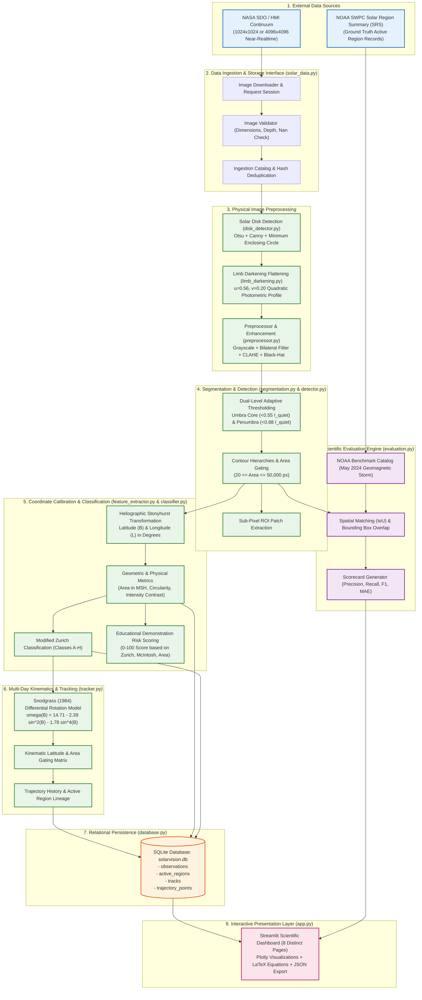

# SolarVision: System Architecture Diagram

## Architectural Overview
The SolarVision architecture is structured into decoupled, modular layers designed for scientific fidelity, reproducibility, and real-time interactive exploration:
1. **Data Ingestion Layer**: Fetches, validates, and caches real-time and historical continuum imagery from NASA Solar Dynamics Observatory (SDO) Helioseismic and Magnetic Imager (HMI).
2. **Computer Vision & Physical Processing Pipeline**: Performs solar disk localization, quadratic limb-darkening compensation, hierarchical dual-threshold segmentation, heliographic coordinate reprojection, Zurich-McIntosh classification, and differential rotation tracking.
3. **Relational Persistence Layer**: ACID-compliant SQLite storage with cascading foreign keys and deterministic deduplication.
4. **Benchmarking & Validation Engine**: Compares detections against official NOAA Space Weather Prediction Center (SWPC) ground truth.
5. **Presentation Layer**: Multi-page interactive Streamlit dashboard with real-time Plotly charts and export utilities.

## System Architecture Diagram (Mermaid)

## Layer Descriptions
- **Data Ingestion**: Fault-tolerant HTTPS retrieval with SHA-256 content deduplication and local disk fallback.
- **Physical Preprocessing**: Solves the limb darkening phenomenon $I(\theta) = I(0)[1 - u(1 - \cos\theta) - v(1 - \cos\theta)^2]$, transforming solar limb pixels to uniform quiet-Sun disk intensity.
- **Segmentation**: Combines adaptive photometric thresholds with morphological opening/closing to separate umbral cores from penumbral filaments.
- **Kinematic Tracking**: Predicts next-frame active region coordinates using the empirical differential rotation law to maintain identity across multi-day observations.
- **Evaluation**: Validates detection bounding boxes against official NOAA SRS bulletins to measure precision, recall, and angular coordinate mean absolute error.
