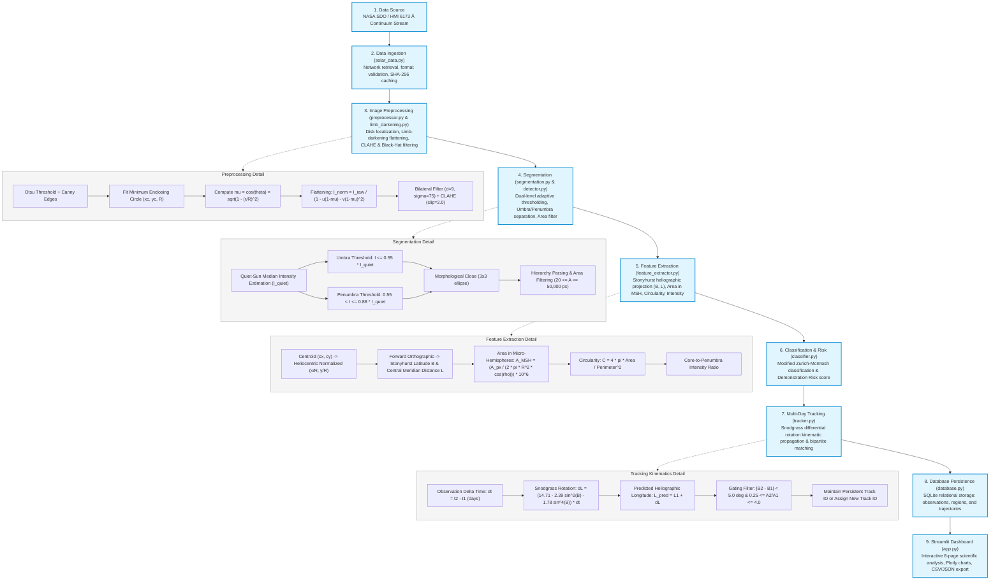

# SolarVision: Data Processing Workflow Diagram

## Pipeline Workflow Specification
The SolarVision processing pipeline executes sequentially from raw satellite payload ingestion to interactive visualization and persistence. Each stage is strictly typed, deterministic, and idempotent.

## Step-by-Step Mathematical & Algorithmic Execution
1. **Data Ingestion**: Accepts local JPG/PNG continuum images or queries NASA SDO JSON feed. Verifies 8-bit or 16-bit depth and generates SHA-256 hash.
2. **Preprocessing**:
   - Isolates the solar disk with radius $R$ and center $(x_c, y_c)$.
   - Applies the limb-darkening compensation function:
     $$\mu = \cos\theta = \sqrt{1 - \left(\frac{r}{R}\right)^2}$$
     $$I_{\text{flattened}}(x, y) = \frac{I_{\text{raw}}(x, y)}{1 - u(1 - \mu) - v(1 - \mu)^2}$$
     where $u = 0.56$ and $v = 0.20$ at $6173\text{ \AA}$.
3. **Dual-Level Segmentation**:
   - Computes quiet-Sun median disk intensity $I_{\text{quiet}}$.
   - Umbral mask: $M_u = \{ (x, y) \mid I(x, y) \le 0.55 \cdot I_{\text{quiet}} \}$.
   - Penumbral mask: $M_p = \{ (x, y) \mid 0.55 \cdot I_{\text{quiet}} < I(x, y) \le 0.88 \cdot I_{\text{quiet}} \}$.
4. **Heliographic Projection**:
   - Corrects foreshortening using orthographic projection onto Stonyhurst coordinates $(\text{B}, \text{L})$.
   - Corrects physical area:
     $$\text{Area}_{\text{MSH}} = \frac{A_{\text{pixels}}}{2\pi R^2 \cos\rho} \times 10^6$$
5. **Modified Zurich Classification**:
   - Classifies regions into classes A through H based on area, umbra/penumbra presence, and bipolar longitudinal span.
6. **Multi-Day Kinematic Tracking**:
   - Propagates heliographic longitude using Snodgrass (1984) differential rotation:
     $$\omega(B) = 14.71 - 2.39\sin^2 B - 1.78\sin^4 B \quad [^\circ/\text{day}]$$
7. **Persistence & Evaluation**:
   - Stores all metadata and regions in SQLite.
   - Evaluates performance against NOAA benchmark observations.
