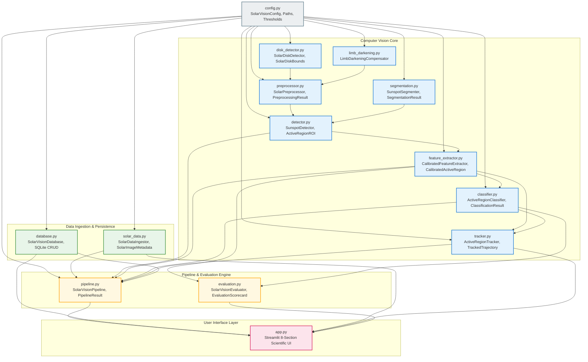

# SolarVision: Module Dependency Diagram

## Architectural Module Hierarchy
The SolarVision codebase is structured into modular, low-coupling components under the `src/` directory. High-level orchestrators (`pipeline.py`, `app.py`, `evaluation.py`) consume lower-level computational kernels without circular dependencies.

## Module Responsibilities and Interfaces
| Module | Primary Class / Functions | Key Dependencies | Primary Output |
| :--- | :--- | :--- | :--- |
| `config.py` | `SolarVisionConfig`, `ConfigLoader` | PyYAML, dataclasses | Centralized configuration dictionary |
| `solar_data.py` | `SolarDataIngestor` | Requests, PIL, hashlib | Validated image arrays & metadata sidecars |
| `disk_detector.py` | `SolarDiskDetector` | OpenCV, NumPy | Solar disk center $(x_c, y_c)$ and radius $R$ |
| `limb_darkening.py`| `LimbDarkeningCompensator` | NumPy, SciPy | Flattened photometric continuum array |
| `preprocessor.py` | `SolarPreprocessor` | OpenCV, NumPy | Denoised, CLAHE-enhanced contrast arrays |
| `segmentation.py` | `SunspotSegmenter` | OpenCV, NumPy | Binary umbral and penumbral segmentations |
| `detector.py` | `SunspotDetector` | OpenCV, NumPy | Bounding boxes, contours, and ROI patches |
| `feature_extractor.py`| `CalibratedFeatureExtractor` | NumPy | Heliographic coordinates $(B, L)$ and area in MSH |
| `classifier.py` | `ActiveRegionClassifier` | NumPy | Modified Zurich class and Demonstration Risk score |
| `tracker.py` | `ActiveRegionTracker` | SciPy, Pandas, Plotly | Multi-day kinematic trajectory linkage |
| `database.py` | `SolarVisionDatabase` | SQLite3 | Relational tables with cascading foreign keys |
| `pipeline.py` | `SolarVisionPipeline` | All CV modules, Database | End-to-end processing & cached retrieval |
| `evaluation.py` | `SolarVisionEvaluator` | Pipeline, NumPy, NOAA catalog | Quantitative precision, recall, IoU, and MAE |
| `app.py` | Streamlit Dashboard | Streamlit, Plotly, Pipeline | 8-section interactive web dashboard |
