# SolarVision: Database Entity Relationship (ER) Diagram

## Relational Schema Design
The SolarVision SQLite storage layer (`src/database.py`) maintains relational integrity with foreign keys, index structures for temporal and heliographic lookups, and deterministic deduplication via SHA-256 hashes.

```mermaid
erDiagram
    image_metadata ||--o{ observations : "produces"
    observations ||--o{ active_regions : "contains"
    observations ||--o{ trajectory_points : "records"
    tracks ||--o{ trajectory_points : "accumulates"

    image_metadata {
        INTEGER id PK "Auto-increment primary key"
        TEXT file_hash UK "SHA-256 content checksum"
        TEXT file_path "Absolute disk storage path"
        TEXT observation_time "ISO-8601 acquisition timestamp"
        TEXT instrument "Telescope/detector (e.g. SDO/HMI)"
        INTEGER image_width "Pixel dimension X"
        INTEGER image_height "Pixel dimension Y"
        INTEGER num_channels "Channel depth (1 or 3)"
        INTEGER file_size_bytes "Disk footprint in bytes"
        INTEGER is_authentic_real_data "1=Real SDO data, 0=Synthetic"
        TEXT created_at "Database insertion timestamp"
    }

    observations {
        INTEGER id PK "Auto-increment primary key"
        INTEGER image_id FK "References image_metadata(id)"
        TEXT timestamp "Observation timestamp"
        TEXT filename "Original image filename"
        REAL disk_center_x "Detected disk centroid X (px)"
        REAL disk_center_y "Detected disk centroid Y (px)"
        REAL disk_radius "Detected disk radius R (px)"
        REAL disk_confidence "Confidence score of circle fit"
        REAL quiet_sun_intensity "Median quiet photosphere intensity"
        INTEGER active_region_count "Total segmented active regions"
        INTEGER is_spotless "Flag: 1 if spotless solar minimum"
        TEXT pipeline_version "SolarVision version string"
        TEXT created_at "Insertion timestamp"
    }

    active_regions {
        INTEGER id PK "Auto-increment primary key"
        INTEGER observation_id FK "References observations(id)"
        TEXT tracking_id "Persistent track identifier"
        TEXT region_id "Intra-observation identifier (e.g. AR-001)"
        INTEGER bbox_x "Bounding box top-left X"
        INTEGER bbox_y "Bounding box top-left Y"
        INTEGER bbox_w "Bounding box width"
        INTEGER bbox_h "Bounding box height"
        REAL centroid_x "Sub-pixel centroid X"
        REAL centroid_y "Sub-pixel centroid Y"
        INTEGER area_pixels "Projected area in pixels"
        REAL perimeter_pixels "Contour perimeter"
        REAL circularity "Morphological compactness"
        REAL equivalent_diameter_px "Equivalent circular diameter"
        REAL mean_intensity "Mean pixel value"
        REAL min_intensity "Core umbral intensity minimum"
        REAL contrast "Relative contrast (1 - I_min / I_quiet)"
        INTEGER umbra_area_pixels "Umbral core area (px)"
        INTEGER penumbra_area_pixels "Penumbral filament area (px)"
        INTEGER has_penumbra "Flag: 1 if penumbra detected"
        INTEGER spot_count "Component count"
        TEXT scientific_status "Candidate Dark Region / Validated"
        REAL detection_confidence "Detection confidence metric"
        REAL lat_deg "Heliographic Stonyhurst Latitude (B)"
        REAL lon_cmd_deg "Central Meridian Distance Longitude (L)"
        REAL heliocentric_angle_deg "Angular distance from disk center"
        REAL cos_theta "Foreshortening correction factor mu"
        REAL area_uhem "True physical area in Micro-Hemispheres"
        REAL umbra_area_uhem "Umbra physical area in MSH"
        REAL penumbra_area_uhem "Penumbra physical area in MSH"
        REAL umbra_penumbra_ratio "Area ratio umbra/penumbra"
        REAL longitudinal_extent_deg "Heliographic longitudinal span"
        REAL latitudinal_extent_deg "Heliographic latitudinal span"
        TEXT mcintosh_class "Zurich-McIntosh 3-component classification"
        TEXT class_name "Full descriptive morphology name"
        TEXT attention_level "Low / Moderate / High Attention"
        TEXT flare_potential "Educational activity index"
        REAL demonstration_risk_score "Normalized demo risk score (0-100)"
        REAL risk_area_factor "Area weight factor"
        REAL risk_complexity_factor "Morphological complexity factor"
        REAL risk_penumbra_factor "Penumbra maturation factor"
        REAL risk_contrast_factor "Intensity gradient factor"
        REAL risk_compactness_factor "Geometric elongation factor"
        TEXT risk_factors_json "JSON serialized risk breakdown"
        TEXT risk_weights_json "JSON serialized weight configuration"
        TEXT rule_trace_json "Deterministic classification logic trace"
        REAL confidence "Classification confidence"
    }

    tracks {
        TEXT track_id PK "Persistent unique track ID"
        TEXT birth_time "Timestamp of first observation"
        TEXT last_seen_time "Timestamp of latest observation"
        TEXT lifecycle_status "Emerging / Stable / Decaying / Rotated Off-Disk"
        INTEGER observation_count "Number of observations linked"
        REAL initial_area_uhem "Area at birth (MSH)"
        REAL latest_area_uhem "Most recent area (MSH)"
        REAL max_area_uhem "Peak observed area (MSH)"
        REAL growth_rate_uhem_per_day "Differential area growth rate"
        REAL mean_latitude "Mean heliographic latitude"
        REAL net_longitude_drift_deg "Observed net drift relative to Carrington"
        TEXT created_at "Insertion timestamp"
        TEXT updated_at "Update timestamp"
    }

    trajectory_points {
        INTEGER id PK "Auto-increment primary key"
        TEXT track_id FK "References tracks(track_id)"
        INTEGER observation_id FK "References observations(id)"
        TEXT timestamp "Observation timestamp"
        REAL predicted_lon_cmd "Snodgrass kinematic predicted longitude"
        REAL actual_lon_cmd "Observed segmented longitude"
        REAL residual_deg "Kinematic residual (observed - predicted)"
        REAL predicted_lat "Predicted latitude"
        REAL actual_lat "Observed latitude"
        REAL area_uhem "Observed area in MSH"
        REAL area_change_rate_uhem_per_day "Observed rate of change"
        INTEGER is_new "1 if track initiation point"
        TEXT event_note "Lifecycle milestone notation"
    }
```

## Relational Constraints and Indexing
1. **Foreign Key Cascades**: Deleting an observation from `observations` automatically cascades to remove child records in `active_regions`, preventing orphaned region artifacts.
2. **Deterministic Deduplication**: An `image_metadata.file_hash` UNIQUE constraint halts duplicate image storage attempts while providing instant cached lookups.
3. **Temporal Ordering**: Indices on `observations.timestamp` and `trajectory_points.timestamp` ensure $O(\log N)$ slicing for historical time-series analytics.
