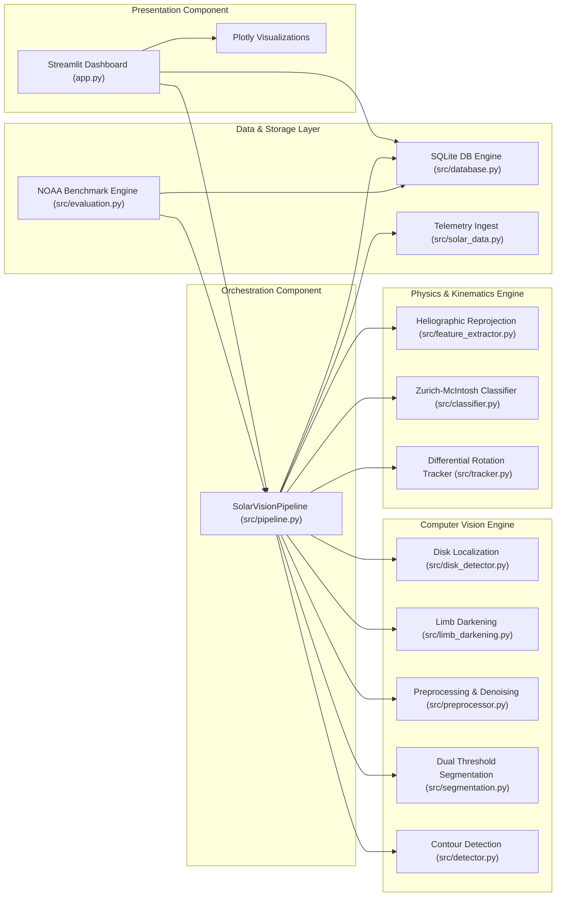

# SolarVision: UML Class & Component Diagram

## 1. Overview
The SolarVision codebase is structured using an object-oriented, modular architecture. Each domain module encapsulates its algorithms within dedicated classes, exchanging strongly typed dataclass structures.

---

## 2. UML Class Diagram (Mermaid)

```mermaid
classDiagram
    direction TB

    %% Pipeline Orchestrator
    class SolarVisionPipeline {
        -config: SolarVisionConfig
        -fetcher: SolarDataFetcher
        -disk_detector: SolarDiskDetector
        -limb_corrector: LimbDarkeningCorrector
        -preprocessor: Preprocessor
        -segmenter: SunspotSegmenter
        -detector: SunspotDetector
        -calibrator: HeliographicCalibrator
        -classifier: McIntoshClassifier
        -tracker: ActiveRegionTracker
        -db: SolarDatabase
        +process_image(input_source) ObservationResult
        +process_sequence(image_paths) List~ObservationResult~
    }

    %% Ingestion & Config
    class SolarVisionConfig {
        +disk_detection: DiskConfig
        +limb_darkening: LimbConfig
        +segmentation: SegmentationConfig
        +classification: ClassificationConfig
        +tracking: TrackingConfig
        +database: DatabaseConfig
        +from_yaml(path: str) SolarVisionConfig
    }

    class SolarDataFetcher {
        -cache_dir: Path
        +fetch_live_sdo() Tuple~np.ndarray, ImageMetadata~
        +load_local_image(path: str) Tuple~np.ndarray, ImageMetadata~
        +compute_sha256(data: bytes) str
    }

    %% Preprocessing Components
    class SolarDiskDetector {
        -otsu_threshold: float
        -canny_low: int
        -canny_high: int
        +detect(image: np.ndarray) DiskDetectionResult
    }

    class LimbDarkeningCorrector {
        -u: float = 0.56
        -v: float = 0.20
        +correct(image: np.ndarray, center: Tuple, radius: float) LimbCorrectionResult
        +compute_mu_matrix(shape: Tuple, center: Tuple, radius: float) np.ndarray
    }

    class Preprocessor {
        -bilateral_d: int = 9
        -bilateral_sigma: float = 75.0
        -clahe_clip: float = 2.0
        +process(image: np.ndarray) PreprocessingResult
        +apply_bilateral(gray: np.ndarray) np.ndarray
        +apply_clahe(gray: np.ndarray) np.ndarray
        +apply_blackhat(gray: np.ndarray) np.ndarray
    }

    %% Segmentation & Detection
    class SunspotSegmenter {
        -umbra_thresh_ratio: float = 0.55
        -penumbra_thresh_ratio: float = 0.88
        +segment(flattened: np.ndarray, i_quiet: float) SegmentationResult
    }

    class SunspotDetector {
        -min_area_px: int = 20
        -max_area_px: int = 50000
        +detect(mask: np.ndarray, raw: np.ndarray) List~RawRegionDetection~
        +extract_roi_patch(image: np.ndarray, bbox: Tuple) np.ndarray
    }

    %% Calibration & Classification
    class HeliographicCalibrator {
        +pixel_to_stonyhurst(cx: float, cy: float, disk: DiskDetectionResult) Tuple~float, float~
        +calculate_msh_area(area_px: float, r_px: float, rho: float) float
        +calculate_circularity(area: float, perimeter: float) float
    }

    class McIntoshClassifier {
        -thresholds: Dict
        +classify(features: PhysicalFeatures) ClassificationResult
        +compute_demonstration_risk(features: PhysicalFeatures) float
    }

    %% Tracking & Persistence
    class ActiveRegionTracker {
        -max_lat_drift: float = 5.0
        -max_long_drift: float = 6.0
        -max_area_ratio: float = 3.5
        +differential_rotation_rate(latitude_deg: float) float
        +update(regions: List~ActiveRegionRecord~, date: datetime) List~TrackRecord~
        +reset() void
    }

    class SolarDatabase {
        -db_path: Path
        +init_schema() void
        +save_observation(obs: ObservationRecord, regions: List) int
        +query_catalog() pd.DataFrame
        +query_tracks() pd.DataFrame
        +get_observation_by_hash(sha256: str) Optional~ObservationRecord~
    }

    %% Relationships
    SolarVisionPipeline *-- SolarVisionConfig
    SolarVisionPipeline *-- SolarDataFetcher
    SolarVisionPipeline *-- SolarDiskDetector
    SolarVisionPipeline *-- LimbDarkeningCorrector
    SolarVisionPipeline *-- Preprocessor
    SolarVisionPipeline *-- SunspotSegmenter
    SolarVisionPipeline *-- SunspotDetector
    SolarVisionPipeline *-- HeliographicCalibrator
    SolarVisionPipeline *-- McIntoshClassifier
    SolarVisionPipeline *-- ActiveRegionTracker
    SolarVisionPipeline *-- SolarDatabase
```

---

## 3. High-Level Component Diagram

