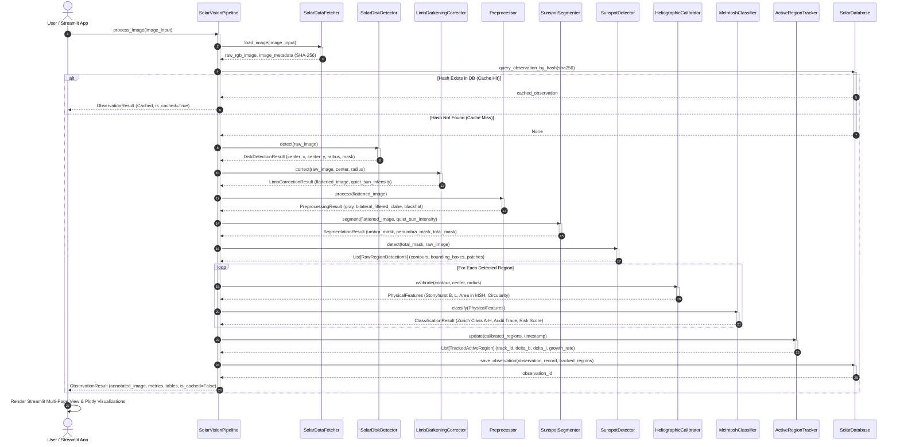

# SolarVision: UML Sequence Diagram

## 1. Overview
This diagram depicts the end-to-end execution sequence of the SolarVision automated pipeline from image ingestion through visual dashboard rendering.

---

## 2. UML Sequence Diagram (Mermaid)

