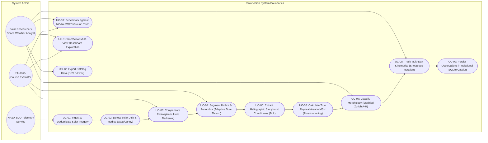

# SolarVision: UML Use Case Diagram

## 1. Overview
The SolarVision system interacts with three primary actors:
- **Solar Researcher / Space Weather Analyst**: Explores active region morphology, monitors multi-day kinematic trajectories, inspects Stonyhurst coordinates, and exports verified region catalogs.
- **Student / Course Evaluator**: Interactively navigates the 8-page Streamlit dashboard, tests synthetic and real edge-case frames, examines before/after visual diagnostic stages, and inspects algorithmic decision traces.
- **Automated Pipeline / SDO Telemetry Service**: Ingests automated telemetry feeds, deduplicates frames via SHA-256 hashing, orchestrates computer vision transformations, and persists records into the SQLite catalog.

---

## 2. UML Use Case Diagram (Mermaid)

---

## 3. Detailed Use Case Specifications

### UC-01: Ingest & Deduplicate Solar Imagery
- **Primary Actor**: Automated SDO Telemetry Service / User
- **Preconditions**: Network connection available or local SDO/HMI image provided.
- **Flow of Events**:
  1. Fetch image from NASA SDO or load from disk.
  2. Compute SHA-256 hash.
  3. Query database; if hash exists, retrieve cached observation.
  4. If new, validate dimensions ($1024 \times 1024$ minimum), format, and depth.
- **Postconditions**: Ingested image ready for preprocessing pipeline.

### UC-04: Segment Umbra & Penumbra
- **Primary Actor**: Solar Researcher / Evaluator
- **Preconditions**: Limb-darkening flattened image available.
- **Flow of Events**:
  1. Calculate quiet-Sun central photospheric median intensity $I_{\text{quiet}}$.
  2. Apply umbral threshold $I \le 0.55 \cdot I_{\text{quiet}}$.
  3. Apply penumbral threshold $0.55 \cdot I_{\text{quiet}} < I \le 0.88 \cdot I_{\text{quiet}}$.
  4. Perform morphological opening ($3\times 3$) and closing ($5\times 5$).
  5. Extract 8-way connected contours with area gating ($20 \le A_{\text{px}} \le 50,000$).
- **Postconditions**: Distinct umbral and penumbral binary masks and contour lists generated.

### UC-08: Track Multi-Day Kinematics
- **Primary Actor**: Solar Researcher / Pipeline
- **Preconditions**: Multi-day sequence of observations processed.
- **Flow of Events**:
  1. For each active region at Stonyhurst latitude $B$, evaluate Snodgrass angular velocity:
     $$\omega(B) = 14.713 - 2.396\sin^2(B) - 1.787\sin^4(B) \quad [\text{deg/day}]$$
  2. Forward-propagate expected longitude: $L_{\text{pred}} = L_0 + \omega(B) \cdot \Delta t$.
  3. Gate spatial candidates: $|\Delta B| \le 5.0^\circ$, $|\Delta L - \omega\Delta t| \le 6.0^\circ$.
  4. Match regions using bipartite assignment, assign persistent `track_id`, update growth rates.
- **Postconditions**: Persistent trajectories and growth rates stored in SQLite.
